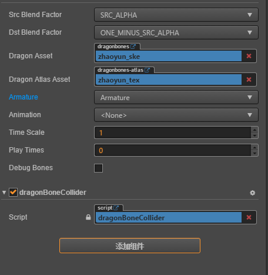

# cocos_dragonBone_collider

原文：https://github.com/akaziki/cocos_dragonBone_collider

主要目的是为了给龙骨骼动态添加碰撞组件

### 使用方法

直接将js文件挂载到带龙骨的节点上

## 具体实现

1. 获取龙骨骼的边界框插槽数据
2. 在带龙骨骼组件的节点上添加子节点
3. 字节点分组设为父节点分组
4. 子节点位置为插槽位置
5. 为子节点添加碰撞组件 
6. 通过插槽数据设置碰撞组件的碰撞点
7. 在update里动态改变子节点的rotation、scale

